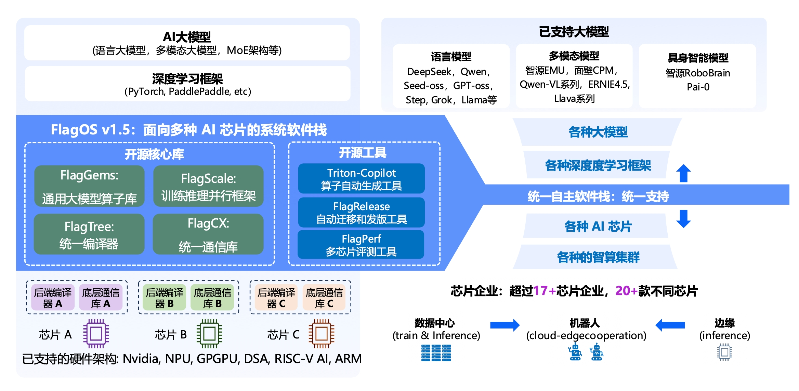

🌐 Language:
[English](README.md) | [简体中文](README.zh-CN.md)

# FlagRelease

FlagRelease is a large-model automated migration, adaptation, and release platform developed by the Beijing Academy of Artificial Intelligence (BAAI) for multi-architecture artificial intelligence chips. The platform aims to enable mainstream large models to be migrated, validated, and released on diverse domestic AI hardware with lower cost and higher efficiency through automated, standardized, and intelligent adaptation workflows.
Built upon the unified and open-source AI system software stack FlagOS, which provides cross-hardware adaptation capabilities, FlagRelease establishes a standardized pipeline that supports automatic migration of large models to different hardware architectures, automated evaluation of migration results, built-in automated deployment and tuning, and multi-chip model packaging and release.
The artifacts released through the FlagRelease platform are published on ModelScope and Hugging Face under the FlagRelease organization, where users can obtain different hardware-specific versions of open-source large models. These models can be downloaded and used directly on the corresponding hardware environments without requiring users to perform model migration themselves, significantly reducing the migration cost for end users.
Currently, the outputs of the FlagRelease platform include validated, hardware-adapted model files and integrated Docker images. Each image contains the core components of FlagOS along with all required model dependencies, allowing users to deploy and use the models directly on the target chips. In addition, each model release provides evaluation results as technical references, enabling users to clearly understand the model’s correctness and performance characteristics across different hardware platforms.
Furthermore, every released model is accompanied by configuration and usage instructions for AnythingLLM, helping users quickly verify the availability of the migrated models and facilitating downstream development and application based on these models.
The overall architecture of FlagOS is illustrated in the figure below:
   

## Release Notes

<!-- START:models -->
| Model Name | 原始模型 | 
|------------|----------|
| DeepSeek-R1-Distill-Qwen-32B | [Huggingface: DeepSeek-R1-Distill-Qwen-32B-FlagOS-NVIDIA](https://huggingface.co/FlagRelease/DeepSeek-R1-Distill-Qwen-32B-FlagOS-NVIDIA) [Modalscope: DeepSeek-R1-Distill-Qwen-32B-FlagOS-NVIDIA](https://modelscope.cn/models/FlagRelease/DeepSeek-R1-Distill-Qwen-32B-FlagOS-NVIDIA) [Huggingface: DeepSeek-R1-Distill-Qwen-32B-FlagOS-Cambricon](https://huggingface.co/FlagRelease/DeepSeek-R1-Distill-Qwen-32B-FlagOS-Cambricon) [Modalscope: DeepSeek-R1-Distill-Qwen-32B-FlagOS-Cambricon](https://modelscope.cn/models/FlagRelease/DeepSeek-R1-Distill-Qwen-32B-FlagOS-Cambricon) |
| MiniMax-M1-80k | [Huggingface: MiniMax-M1-80k-FlagOS](https://huggingface.co/FlagRelease/MiniMax-M1-80k-FlagOS) [Modalscope: MiniMax-M1-80k-FlagOS](https://modelscope.cn/models/FlagRelease/MiniMax-M1-80k-FlagOS) |
| Qwen2-7B-Instruct | [Huggingface: Qwen2-7B-Instruct-FlagOS](https://huggingface.co/FlagRelease/Qwen2-7B-Instruct-FlagOS) [Modalscope: Qwen2-7B-Instruct-FlagOS](https://modelscope.cn/models/FlagRelease/Qwen2-7B-Instruct-FlagOS) |
| Qwen3-235B-A22B | [Huggingface: Qwen3-235B-A22B-FlagOS-nvidia](https://huggingface.co/FlagRelease/Qwen3-235B-A22B-FlagOS-nvidia) [Modalscope: Qwen3-235B-A22B-FlagOS-nvidia](https://modelscope.cn/models/FlagRelease/Qwen3-235B-A22B-FlagOS-nvidia) |
| phi-4 | [Huggingface: phi-4-FlagOS](https://huggingface.co/FlagRelease/phi-4-FlagOS) [Modalscope: phi-4-FlagOS](https://modelscope.cn/models/FlagRelease/phi-4-FlagOS) [Huggingface: phi-4-hygon-FlagOS](https://huggingface.co/FlagRelease/phi-4-hygon-FlagOS) [Modalscope: phi-4-hygon-FlagOS](https://modelscope.cn/models/FlagRelease/phi-4-hygon-FlagOS) [Huggingface: phi-4-metax-FlagOS](https://huggingface.co/FlagRelease/phi-4-metax-FlagOS) [Modalscope: phi-4-metax-FlagOS](https://modelscope.cn/models/FlagRelease/phi-4-metax-FlagOS) |
| Qwen2.5-32B-Instruct | [Huggingface: Qwen2.5-32B-Instruct-FlagOS-Nvidia](https://huggingface.co/FlagRelease/Qwen2.5-32B-Instruct-FlagOS-Nvidia) [Modalscope: Qwen2.5-32B-Instruct-FlagOS-Nvidia](https://modelscope.cn/models/FlagRelease/Qwen2.5-32B-Instruct-FlagOS-Nvidia) |
| RoboBrain2.0-7B-W8A16 | [Huggingface: RoboBrain2.0-7B-W8A16-FlagOS](https://huggingface.co/FlagRelease/RoboBrain2.0-7B-W8A16-FlagOS) [Modalscope: RoboBrain2.0-7B-W8A16-FlagOS](https://modelscope.cn/models/FlagRelease/RoboBrain2.0-7B-W8A16-FlagOS) |
| pi0 | [Huggingface: pi0-FlagOS](https://huggingface.co/FlagRelease/pi0-FlagOS) [Modalscope: pi0-FlagOS](https://modelscope.cn/models/FlagRelease/pi0-FlagOS) |
| DeepSeek-R1-INT8 | [Huggingface: DeepSeek-R1-FlagOS-Iluvatar-INT8](https://huggingface.co/FlagRelease/DeepSeek-R1-FlagOS-Iluvatar-INT8) [Modalscope: DeepSeek-R1-FlagOS-Iluvatar-INT8](https://modelscope.cn/models/FlagRelease/DeepSeek-R1-FlagOS-Iluvatar-INT8) [Huggingface: DeepSeek-R1-FlagOS-Kunlunxin-INT8](https://huggingface.co/FlagRelease/DeepSeek-R1-FlagOS-Kunlunxin-INT8) [Modalscope: DeepSeek-R1-FlagOS-Kunlunxin-INT8](https://modelscope.cn/models/FlagRelease/DeepSeek-R1-FlagOS-Kunlunxin-INT8) |
| DeepSeek-R1-INT4 | [Huggingface: DeepSeek-R1-INT4-FlagOS-Iluvatar](https://huggingface.co/FlagRelease/DeepSeek-R1-INT4-FlagOS-Iluvatar) [Modalscope: DeepSeek-R1-INT4-FlagOS-Iluvatar](https://modelscope.cn/models/FlagRelease/DeepSeek-R1-INT4-FlagOS-Iluvatar) |
| grok-2 | [Huggingface: grok-2-FlagOS](https://huggingface.co/FlagRelease/grok-2-FlagOS) [Modalscope: grok-2-FlagOS](https://modelscope.cn/models/FlagRelease/grok-2-FlagOS) |
| RoboBrain-X0 | [Huggingface: RoboBrain-X0-FlagOS](https://huggingface.co/FlagRelease/RoboBrain-X0-FlagOS) [Modalscope: RoboBrain-X0-FlagOS](https://modelscope.cn/models/FlagRelease/RoboBrain-X0-FlagOS) |
| MiniCPM-V-4 | [Huggingface: MiniCPM-V-4-FlagOS](https://huggingface.co/FlagRelease/MiniCPM-V-4-FlagOS) [Modalscope: MiniCPM-V-4-FlagOS](https://modelscope.cn/models/FlagRelease/MiniCPM-V-4-FlagOS) [Huggingface: MiniCPM-V-4-metax-FlagOS](https://huggingface.co/FlagRelease/MiniCPM-V-4-metax-FlagOS) [Modalscope: MiniCPM-V-4-metax-FlagOS](https://modelscope.cn/models/FlagRelease/MiniCPM-V-4-metax-FlagOS) |
| Qwen3-VL-235B-A22B-Instruct | [Huggingface: Qwen3-VL-235B-A22B-Instruct-FlagOS](https://huggingface.co/FlagRelease/Qwen3-VL-235B-A22B-Instruct-FlagOS) [Modalscope: Qwen3-VL-235B-A22B-Instruct-FlagOS](https://modelscope.cn/models/FlagRelease/Qwen3-VL-235B-A22B-Instruct-FlagOS) |
| GLM-4.5 | [Huggingface: GLM-4.5-FlagOS](https://huggingface.co/FlagRelease/GLM-4.5-FlagOS) [Modalscope: GLM-4.5-FlagOS](https://modelscope.cn/models/FlagRelease/GLM-4.5-FlagOS) |
| step3 | [Huggingface: step3-FlagOS](https://huggingface.co/FlagRelease/step3-FlagOS) [Modalscope: step3-FlagOS](https://modelscope.cn/models/FlagRelease/step3-FlagOS) |
| Qwen3.5-397B-A17B-zhenwu | [Huggingface: Qwen3.5-397B-A17B-zhenwu-FlagOS](https://huggingface.co/FlagRelease/Qwen3.5-397B-A17B-zhenwu-FlagOS) [Modalscope: Qwen3.5-397B-A17B-zhenwu-FlagOS](https://modelscope.cn/models/FlagRelease/Qwen3.5-397B-A17B-zhenwu-FlagOS) |
| RoboBrain2.0-7B | [Huggingface: RoboBrain2.0-7B-FlagOS](https://huggingface.co/FlagRelease/RoboBrain2.0-7B-FlagOS) [Modalscope: RoboBrain2.0-7B-FlagOS](https://modelscope.cn/models/FlagRelease/RoboBrain2.0-7B-FlagOS) [Huggingface: RoboBrain2.0-7B-FlagOS-Ascend](https://huggingface.co/FlagRelease/RoboBrain2.0-7B-FlagOS-Ascend) [Modalscope: RoboBrain2.0-7B-FlagOS-Ascend](https://modelscope.cn/models/FlagRelease/RoboBrain2.0-7B-FlagOS-Ascend) [Huggingface: RoboBrain2.0-7B-metax-FlagOS](https://huggingface.co/FlagRelease/RoboBrain2.0-7B-metax-FlagOS) [Modalscope: RoboBrain2.0-7B-metax-FlagOS](https://modelscope.cn/models/FlagRelease/RoboBrain2.0-7B-metax-FlagOS) |
| Kimi-K2-Instruct | [Huggingface: Kimi-K2-Instruct-FlagOS](https://huggingface.co/FlagRelease/Kimi-K2-Instruct-FlagOS) [Modalscope: Kimi-K2-Instruct-FlagOS](https://modelscope.cn/models/FlagRelease/Kimi-K2-Instruct-FlagOS) |
| Hunyuan-A13B-Instruct | [Huggingface: Hunyuan-A13B-Instruct-FlagOS](https://huggingface.co/FlagRelease/Hunyuan-A13B-Instruct-FlagOS) [Modalscope: Hunyuan-A13B-Instruct-FlagOS](https://modelscope.cn/models/FlagRelease/Hunyuan-A13B-Instruct-FlagOS) |
| RoboBrain2.0-7B-FP8Dynamic | [Huggingface: RoboBrain2.0-7B-FP8Dynamic-FlagOS](https://huggingface.co/FlagRelease/RoboBrain2.0-7B-FP8Dynamic-FlagOS) [Modalscope: RoboBrain2.0-7B-FP8Dynamic-FlagOS](https://modelscope.cn/models/FlagRelease/RoboBrain2.0-7B-FP8Dynamic-FlagOS) |
| RoboBrain-X0-Preview | [Huggingface: RoboBrain-X0-Preview-FlagOS](https://huggingface.co/FlagRelease/RoboBrain-X0-Preview-FlagOS) [Modalscope: RoboBrain-X0-Preview-FlagOS](https://modelscope.cn/models/FlagRelease/RoboBrain-X0-Preview-FlagOS) [Huggingface: RoboBrain-X0-Preview-ascend-FlagOS](https://huggingface.co/FlagRelease/RoboBrain-X0-Preview-ascend-FlagOS) [Modalscope: RoboBrain-X0-Preview-ascend-FlagOS](https://modelscope.cn/models/FlagRelease/RoboBrain-X0-Preview-ascend-FlagOS) |
| Kimi-K2-Thinking | [Huggingface: Kimi-K2-Thinking-FlagOS](https://huggingface.co/FlagRelease/Kimi-K2-Thinking-FlagOS) [Modalscope: Kimi-K2-Thinking-FlagOS](https://modelscope.cn/models/FlagRelease/Kimi-K2-Thinking-FlagOS) |
| MiniCPM-o-4.5-zhenwu | [Huggingface: MiniCPM-o-4.5-zhenwu-FlagOS](https://huggingface.co/FlagRelease/MiniCPM-o-4.5-zhenwu-FlagOS) [Modalscope: MiniCPM-o-4.5-zhenwu-FlagOS](https://modelscope.cn/models/FlagRelease/MiniCPM-o-4.5-zhenwu-FlagOS) |
| DeepSeek-R1-BF16 | [Huggingface: DeepSeek-R1-FlagOS-Nvidia-BF16](https://huggingface.co/FlagRelease/DeepSeek-R1-FlagOS-Nvidia-BF16) [Modalscope: DeepSeek-R1-FlagOS-Nvidia-BF16](https://modelscope.cn/models/FlagRelease/DeepSeek-R1-FlagOS-Nvidia-BF16) [Huggingface: DeepSeek-R1-FlagOS-Metax-BF16](https://huggingface.co/FlagRelease/DeepSeek-R1-FlagOS-Metax-BF16) [Modalscope: DeepSeek-R1-FlagOS-Metax-BF16](https://modelscope.cn/models/FlagRelease/DeepSeek-R1-FlagOS-Metax-BF16) [Huggingface: DeepSeek-R1-FlagOS-Cambricon-BF16](https://huggingface.co/FlagRelease/DeepSeek-R1-FlagOS-Cambricon-BF16) [Modalscope: DeepSeek-R1-FlagOS-Cambricon-BF16](https://modelscope.cn/models/FlagRelease/DeepSeek-R1-FlagOS-Cambricon-BF16) |
| MiniMax-M2 | [Huggingface: MiniMax-M2-FlagOS](https://huggingface.co/FlagRelease/MiniMax-M2-FlagOS) [Modalscope: MiniMax-M2-FlagOS](https://modelscope.cn/models/FlagRelease/MiniMax-M2-FlagOS) |
| Qwen3-Omni-30B-A3B-Instruct | [Huggingface: Qwen3-Omni-30B-A3B-Instruct-FlagOS](https://huggingface.co/FlagRelease/Qwen3-Omni-30B-A3B-Instruct-FlagOS) [Modalscope: Qwen3-Omni-30B-A3B-Instruct-FlagOS](https://modelscope.cn/models/FlagRelease/Qwen3-Omni-30B-A3B-Instruct-FlagOS) |
| Qwen2-7B | [Huggingface: Qwen2-7B-FlagOS-Arm](https://huggingface.co/FlagRelease/Qwen2-7B-FlagOS-Arm) [Modalscope: Qwen2-7B-FlagOS-Arm](https://modelscope.cn/models/FlagRelease/Qwen2-7B-FlagOS-Arm) |
| QwQ-32B | [Huggingface: QwQ-32B-FlagOS-Cambricon](https://huggingface.co/FlagRelease/QwQ-32B-FlagOS-Cambricon) [Modalscope: QwQ-32B-FlagOS-Cambricon](https://modelscope.cn/models/FlagRelease/QwQ-32B-FlagOS-Cambricon) [Huggingface: QwQ-32B-FlagOS-Nvidia](https://huggingface.co/FlagRelease/QwQ-32B-FlagOS-Nvidia) [Modalscope: QwQ-32B-FlagOS-Nvidia](https://modelscope.cn/models/FlagRelease/QwQ-32B-FlagOS-Nvidia) [Huggingface: QwQ-32B-FlagOS-Iluvatar](https://huggingface.co/FlagRelease/QwQ-32B-FlagOS-Iluvatar) [Modalscope: QwQ-32B-FlagOS-Iluvatar](https://modelscope.cn/models/FlagRelease/QwQ-32B-FlagOS-Iluvatar) |
| MiniCPM-o-4.5 | [Huggingface: MiniCPM-o-4.5-ascend-FlagOS](https://huggingface.co/FlagRelease/MiniCPM-o-4.5-ascend-FlagOS) [Modalscope: MiniCPM-o-4.5-ascend-FlagOS](https://modelscope.cn/models/FlagRelease/MiniCPM-o-4.5-ascend-FlagOS) [Huggingface: MiniCPM-o-4.5-metax-FlagOS](https://huggingface.co/FlagRelease/MiniCPM-o-4.5-metax-FlagOS) [Modalscope: MiniCPM-o-4.5-metax-FlagOS](https://modelscope.cn/models/FlagRelease/MiniCPM-o-4.5-metax-FlagOS) [Huggingface: MiniCPM-o-4.5-iluvatar-FlagOS](https://huggingface.co/FlagRelease/MiniCPM-o-4.5-iluvatar-FlagOS) [Modalscope: MiniCPM-o-4.5-iluvatar-FlagOS](https://modelscope.cn/models/FlagRelease/MiniCPM-o-4.5-iluvatar-FlagOS) [Huggingface: MiniCPM-o-4.5-hygon-FlagOS](https://huggingface.co/FlagRelease/MiniCPM-o-4.5-hygon-FlagOS) [Modalscope: MiniCPM-o-4.5-hygon-FlagOS](https://modelscope.cn/models/FlagRelease/MiniCPM-o-4.5-hygon-FlagOS) [Huggingface: MiniCPM-o-4.5-nvidia-FlagOS](https://huggingface.co/FlagRelease/MiniCPM-o-4.5-nvidia-FlagOS) [Modalscope: MiniCPM-o-4.5-nvidia-FlagOS](https://modelscope.cn/models/FlagRelease/MiniCPM-o-4.5-nvidia-FlagOS) |
| Qwen3.5-397B-A17B | [Huggingface: Qwen3.5-397B-A17B-nvidia-FlagOS](https://huggingface.co/FlagRelease/Qwen3.5-397B-A17B-nvidia-FlagOS) [Modalscope: Qwen3.5-397B-A17B-nvidia-FlagOS](https://modelscope.cn/models/FlagRelease/Qwen3.5-397B-A17B-nvidia-FlagOS) [Huggingface: Qwen3.5-397B-A17B-ascend-FlagOS](https://huggingface.co/FlagRelease/Qwen3.5-397B-A17B-ascend-FlagOS) [Modalscope: Qwen3.5-397B-A17B-ascend-FlagOS](https://modelscope.cn/models/FlagRelease/Qwen3.5-397B-A17B-ascend-FlagOS) |
| Qwen3-Next-80B-A3B-Instruct | [Huggingface: Qwen3-Next-80B-A3B-Instruct-FlagOS](https://huggingface.co/FlagRelease/Qwen3-Next-80B-A3B-Instruct-FlagOS) [Modalscope: Qwen3-Next-80B-A3B-Instruct-FlagOS](https://modelscope.cn/models/FlagRelease/Qwen3-Next-80B-A3B-Instruct-FlagOS) [Huggingface: Qwen3-Next-80B-A3B-Instruct-metax-FlagOS](https://huggingface.co/FlagRelease/Qwen3-Next-80B-A3B-Instruct-metax-FlagOS) [Modalscope: Qwen3-Next-80B-A3B-Instruct-metax-FlagOS](https://modelscope.cn/models/FlagRelease/Qwen3-Next-80B-A3B-Instruct-metax-FlagOS) |
| Qwen3-32B | [Huggingface: Qwen3-32B-FlagOS](https://huggingface.co/FlagRelease/Qwen3-32B-FlagOS) [Modalscope: Qwen3-32B-FlagOS](https://modelscope.cn/models/FlagRelease/Qwen3-32B-FlagOS) [Huggingface: Qwen3-32B-ascend-FlagOS](https://huggingface.co/FlagRelease/Qwen3-32B-ascend-FlagOS) [Modalscope: Qwen3-32B-ascend-FlagOS](https://modelscope.cn/models/FlagRelease/Qwen3-32B-ascend-FlagOS) |
| Qwen3-8B | [Huggingface: Qwen3-8B-metax-FlagOS](https://huggingface.co/FlagRelease/Qwen3-8B-metax-FlagOS) [Modalscope: Qwen3-8B-metax-FlagOS](https://modelscope.cn/models/FlagRelease/Qwen3-8B-metax-FlagOS) [Huggingface: Qwen3-8B-FlagOS](https://huggingface.co/FlagRelease/Qwen3-8B-FlagOS) [Modalscope: Qwen3-8B-FlagOS](https://modelscope.cn/models/FlagRelease/Qwen3-8B-FlagOS) [Huggingface: Qwen3-8B-mthreads-FlagOS](https://huggingface.co/FlagRelease/Qwen3-8B-mthreads-FlagOS) [Modalscope: Qwen3-8B-mthreads-FlagOS](https://modelscope.cn/models/FlagRelease/Qwen3-8B-mthreads-FlagOS) |
| Emu3.5 | [Huggingface: Emu3.5-FlagOS](https://huggingface.co/FlagRelease/Emu3.5-FlagOS) [Modalscope: Emu3.5-FlagOS](https://modelscope.cn/models/FlagRelease/Emu3.5-FlagOS) |
| MiniCPM_o_2.6 | [Huggingface: MiniCPM_o_2.6-FlagOS-Cambricon](https://huggingface.co/FlagRelease/MiniCPM_o_2.6-FlagOS-Cambricon) [Modalscope: MiniCPM_o_2.6-FlagOS-Cambricon](https://modelscope.cn/models/FlagRelease/MiniCPM_o_2.6-FlagOS-Cambricon) [Huggingface: MiniCPM_o_2.6-FlagOS-NVIDIA](https://huggingface.co/FlagRelease/MiniCPM_o_2.6-FlagOS-NVIDIA) [Modalscope: MiniCPM_o_2.6-FlagOS-NVIDIA](https://modelscope.cn/models/FlagRelease/MiniCPM_o_2.6-FlagOS-NVIDIA) |
| DeepSeek-V3.2-Exp | [Huggingface: DeepSeek-V3.2-Exp-FlagOS](https://huggingface.co/FlagRelease/DeepSeek-V3.2-Exp-FlagOS) [Modalscope: DeepSeek-V3.2-Exp-FlagOS](https://modelscope.cn/models/FlagRelease/DeepSeek-V3.2-Exp-FlagOS) |
| Qwen2.5-VL-32B-Instruct-BF16 | [Huggingface: Qwen2.5-VL-32B-Instruct-FlagOS-Metax-BF16](https://huggingface.co/FlagRelease/Qwen2.5-VL-32B-Instruct-FlagOS-Metax-BF16) [Modalscope: Qwen2.5-VL-32B-Instruct-FlagOS-Metax-BF16](https://modelscope.cn/models/FlagRelease/Qwen2.5-VL-32B-Instruct-FlagOS-Metax-BF16) |
| Qwen2.5-VL-32B-Instruct | [Huggingface: Qwen2.5-VL-32B-Instruct-FlagOS-Nvidia](https://huggingface.co/FlagRelease/Qwen2.5-VL-32B-Instruct-FlagOS-Nvidia) [Modalscope: Qwen2.5-VL-32B-Instruct-FlagOS-Nvidia](https://modelscope.cn/models/FlagRelease/Qwen2.5-VL-32B-Instruct-FlagOS-Nvidia) |
| RoboBrain2.5-8B | [Huggingface: RoboBrain2.5-8B-FlagOS](https://huggingface.co/FlagRelease/RoboBrain2.5-8B-FlagOS) [Modalscope: RoboBrain2.5-8B-FlagOS](https://modelscope.cn/models/FlagRelease/RoboBrain2.5-8B-FlagOS) [Huggingface: RoboBrain2.5-8B-ascend-FlagOS](https://huggingface.co/FlagRelease/RoboBrain2.5-8B-ascend-FlagOS) [Modalscope: RoboBrain2.5-8B-ascend-FlagOS](https://modelscope.cn/models/FlagRelease/RoboBrain2.5-8B-ascend-FlagOS) |
| gpt-oss-120b | [Huggingface: gpt-oss-120b-FlagOS](https://huggingface.co/FlagRelease/gpt-oss-120b-FlagOS) [Modalscope: gpt-oss-120b-FlagOS](https://modelscope.cn/models/FlagRelease/gpt-oss-120b-FlagOS) |
| Qwen3-4B | [Huggingface: Qwen3-4B-FlagOS-cambricon](https://huggingface.co/FlagRelease/Qwen3-4B-FlagOS-cambricon) [Modalscope: Qwen3-4B-FlagOS-cambricon](https://modelscope.cn/models/FlagRelease/Qwen3-4B-FlagOS-cambricon) [Huggingface: Qwen3-4B-FlagOS-Nvidia](https://huggingface.co/FlagRelease/Qwen3-4B-FlagOS-Nvidia) [Modalscope: Qwen3-4B-FlagOS-Nvidia](https://modelscope.cn/models/FlagRelease/Qwen3-4B-FlagOS-Nvidia) [Huggingface: Qwen3-4B-FlagOS-Iluvatar](https://huggingface.co/FlagRelease/Qwen3-4B-FlagOS-Iluvatar) [Modalscope: Qwen3-4B-FlagOS-Iluvatar](https://modelscope.cn/models/FlagRelease/Qwen3-4B-FlagOS-Iluvatar) [Huggingface: Qwen3-4B-FlagOS-Metax](https://huggingface.co/FlagRelease/Qwen3-4B-FlagOS-Metax) [Modalscope: Qwen3-4B-FlagOS-Metax](https://modelscope.cn/models/FlagRelease/Qwen3-4B-FlagOS-Metax) [Huggingface: Qwen3-4B-FlagOS-Ascend](https://huggingface.co/FlagRelease/Qwen3-4B-FlagOS-Ascend) [Modalscope: Qwen3-4B-FlagOS-Ascend](https://modelscope.cn/models/FlagRelease/Qwen3-4B-FlagOS-Ascend) [Huggingface: Qwen3-4B-hygon-FlagOS](https://huggingface.co/FlagRelease/Qwen3-4B-hygon-FlagOS) [Modalscope: Qwen3-4B-hygon-FlagOS](https://modelscope.cn/models/FlagRelease/Qwen3-4B-hygon-FlagOS) |
| Qwen3-30B-A3B | [Huggingface: Qwen3-30B-A3B-FlagOS-nvidia](https://huggingface.co/FlagRelease/Qwen3-30B-A3B-FlagOS-nvidia) [Modalscope: Qwen3-30B-A3B-FlagOS-nvidia](https://modelscope.cn/models/FlagRelease/Qwen3-30B-A3B-FlagOS-nvidia) [Huggingface: Qwen3-30B-A3B-Iluvatar-FlagOS](https://huggingface.co/FlagRelease/Qwen3-30B-A3B-Iluvatar-FlagOS) [Modalscope: Qwen3-30B-A3B-Iluvatar-FlagOS](https://modelscope.cn/models/FlagRelease/Qwen3-30B-A3B-Iluvatar-FlagOS) |
| RoboBrain2.0-32B | [Huggingface: RoboBrain2.0-32B-FlagOS](https://huggingface.co/FlagRelease/RoboBrain2.0-32B-FlagOS) [Modalscope: RoboBrain2.0-32B-FlagOS](https://modelscope.cn/models/FlagRelease/RoboBrain2.0-32B-FlagOS) [Huggingface: RoboBrain2.0-32B-Ascend-FlagOS](https://huggingface.co/FlagRelease/RoboBrain2.0-32B-Ascend-FlagOS) [Modalscope: RoboBrain2.0-32B-Ascend-FlagOS](https://modelscope.cn/models/FlagRelease/RoboBrain2.0-32B-Ascend-FlagOS) |
| Qwen3-235B-A22B-Instruct-2507 | [Huggingface: Qwen3-235B-A22B-Instruct-2507-FlagOS](https://huggingface.co/FlagRelease/Qwen3-235B-A22B-Instruct-2507-FlagOS) [Modalscope: Qwen3-235B-A22B-Instruct-2507-FlagOS](https://modelscope.cn/models/FlagRelease/Qwen3-235B-A22B-Instruct-2507-FlagOS) [Huggingface: Qwen3-235B-A22B-Instruct-2507-hygon-FlagOS](https://huggingface.co/FlagRelease/Qwen3-235B-A22B-Instruct-2507-hygon-FlagOS) [Modalscope: Qwen3-235B-A22B-Instruct-2507-hygon-FlagOS](https://modelscope.cn/models/FlagRelease/Qwen3-235B-A22B-Instruct-2507-hygon-FlagOS) |
| Seed-OSS-36B-Instruct | [Huggingface: Seed-OSS-36B-Instruct-FlagOS](https://huggingface.co/FlagRelease/Seed-OSS-36B-Instruct-FlagOS) [Modalscope: Seed-OSS-36B-Instruct-FlagOS](https://modelscope.cn/models/FlagRelease/Seed-OSS-36B-Instruct-FlagOS) |
| ERNIE-4.5-300B-A47B-PT | [Huggingface: ERNIE-4.5-300B-A47B-PT-FlagOS](https://huggingface.co/FlagRelease/ERNIE-4.5-300B-A47B-PT-FlagOS) [Modalscope: ERNIE-4.5-300B-A47B-PT-FlagOS](https://modelscope.cn/models/FlagRelease/ERNIE-4.5-300B-A47B-PT-FlagOS) |

<!-- END:models -->

## Example Usage of Released Artifacts
The outputs of FlagRelease include validated large-model files and integrated FlagOS Docker images. By using these artifacts, users can rapidly deploy and run large models on different hardware platforms without performing model migration themselves or configuring complex software environments.
Example Workflow
1. Download Open-Source Model Weights
  - Visit the FlagRelease pages on ModelScope or Hugging Face, select the required large model and the corresponding hardware-specific version, and download the model weight files directly.
2. Download the FlagOS Image
  - Obtain the officially provided integrated FlagOS Docker image, which includes the unified software stack and built-in hardware adaptation support.
3. Deployment and Execution
  - Combine the downloaded model weights with the FlagOS image to run the model directly on the target hardware.
  - FlagOS automatically manages hardware resources and supports multi-chip parallel execution, eliminating the need for manual environment configuration.
Example Application Scenarios
- Research and experimentation: rapidly deploy large models for inference without concern for underlying hardware differences.
- Production environments: directly deploy hardware-specific versions of models as services, ensuring performance and stability across different AI chips.

